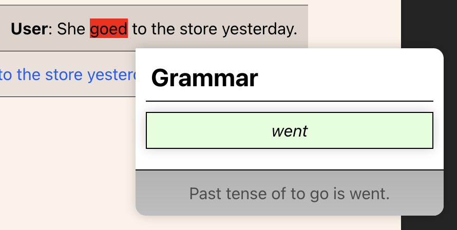

# PenPal Language Learning App

PenPal is a small Node.js application that utilizes OpenAI to help individuals learn a new language. Users can converse with the AI in any language and receive feedback on their grammar, spelling, style, and tone. The application has a React/Vite front end with an Express server that communicates with the OpenAI API.

## Technologies Used

The PenPal language learning app utilizes the following technologies:

- Node.js
- Express
- React
- Vite
- OpenAI API

## Getting Started

To run the PenPal application locally, follow these steps:

1. Clone the repository to your local machine.
2. Navigate to the project directory.
3. Install the dependencies by running the command `npm install`.
4. Create a `.env` file in the project root directory and provide your own OpenAI API key. The file should look like this:

OPENAI_API_KEY=your-api-key

5. Start the server by running the command `npm run serve`.
6. Start the web app by running the command `npm run dev`.

## Usage

Once the server and web app are running locally, you can access the PenPal language learning app in your web browser. The app provides a chat interface where you can converse with the AI in any language. The AI will provide feedback on your grammar, spelling, style, and tone.

## Screenshots

